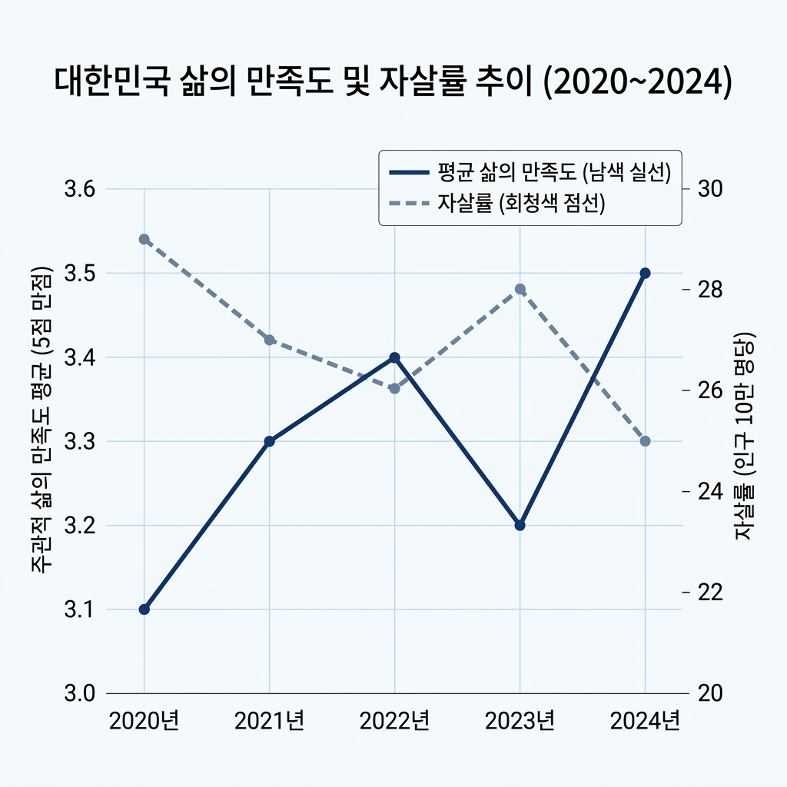
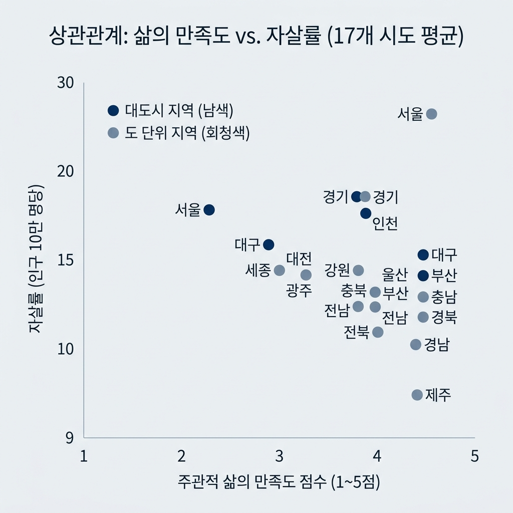
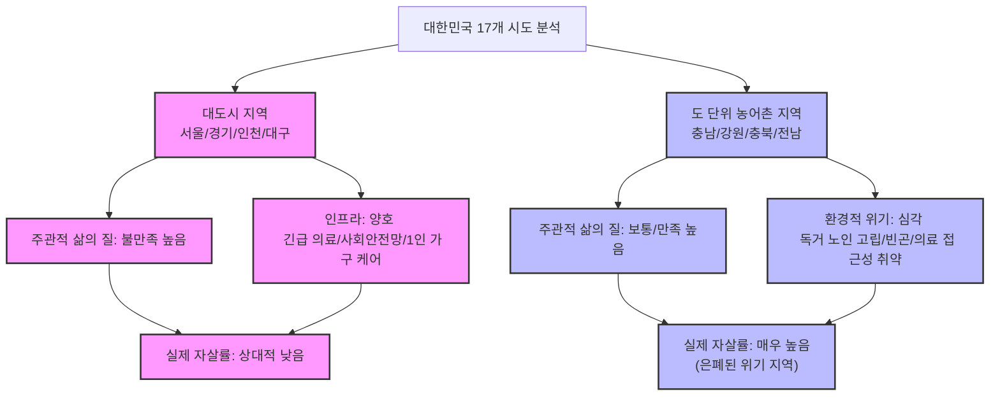

# [보고서] 삶의 만족도와 자살률의 상관관계 분석 (2020~2024)

본 보고서는 2020년부터 2024년까지 대한민국의 17개 시도별 **주관적 삶의 만족도** 데이터와 **인구 10만 명당 자살률** 데이터를 연계하여 두 지표 간의 상관관계를 다각도로 분석하고 사회정책적 시사점을 도출한 보고서입니다.

---

## 1. 분석 개요 및 데이터 구성

* **데이터 출처**: 현재 디렉터리 내 `data` 폴더에 적재된 두 개의 엑셀 파일
  1. **삶의 만족도**: `삶의_만족도_시도__20260606195059.xlsx` (통계청 사회조사 등 표본 기반 설문 데이터)
  2. **자살률 (인구 10만 명당)**: `인구십만명당_자살률_시도_시_군_구__20260606194913.xlsx` (사망원인통계 등 행정 등록 데이터)
* **분석 대상 기간**: 2020년 ~ 2024년 (5개년)
* **분석 대상 지역**: 전국 및 17개 광역 시도 (세종특별자치시 포함, 강원특별자치도/전북특별자치도/제주특별자치도 정규화 매핑 적용)
* **지표 가공**:
  * **삶의 만족도 점수(Satisfaction Score)**: 주관적 만족도 응답 비율(매우 만족, 약간 만족, 보통, 약간 불만족, 매우 불만족)을 활용하여 가중평균 점수 산출 (매우 만족 5점 ~ 매우 불만족 1점)
  * **긍정 응답 비율(Positive Ratio)**: '매우 만족' + '약간 만족' 비율 (%)
  * **부정 응답 비율(Negative Ratio)**: '약간 불만족' + '매우 불만족' 비율 (%)
  * **자살률(Suicide Rate)**: 인구 10만 명당 자살 사망자 수

---

## 2. 전국 시계열 트렌드 분석 (2020 ~ 2024)

국가 전체 차원에서 지난 5년간 삶의 만족도 지표와 자살률이 어떻게 변화해 왔는지 분석했습니다.

| 연도 | 만족도 점수 (5점 만점) | 만족(긍정) 비율 | 불만족(부정) 비율 | 자살률 (10만 명당) |
| :---: | :---: | :---: | :---: | :---: |
| **2020년** | 3.423 | 42.7% | 12.5% | 25.7 |
| **2021년** | 3.161 | 34.0% | 22.9% | 26.0 |
| **2022년** | 3.388 | 43.3% | 14.1% | 25.2 |
| **2023년** | 3.366 | 42.2% | 14.5% | 27.3 |
| **2024년** | 3.367 | 40.1% | 12.7% | 29.1 |

> [!NOTE]  
> **트렌드 분석 결과**
> * **2021년 코로나 팬데믹 장기화의 충격**: 2021년에는 주관적 삶의 만족도 점수가 **3.161**로 급감하고, 삶에 불만족한다는 부정 응답 비율이 **22.9%**로 전년 대비 2배 가까이 폭증했습니다. 그러나 자살률은 26.0명으로 미미한 상승에 그쳤습니다. 이는 팬데믹 초기 사회적 긴장과 지원 대책 등으로 인해 급격한 심리적 불만족이 실제 극단적 선택으로 직결되지는 않았음을 의미합니다.
> * **포스트 코로나 시기(2023~2024년)의 자살률 급증**: 코로나 일상회복이 이루어지면서 주관적 삶의 만족도는 3.38점대로 예년 수준을 회복했으나, 실제 자살률은 2023년 27.3명, 2024년 **29.1명**으로 오히려 **급격하게 증가**했습니다. 이는 경제적 고통(고금리, 고물가)의 누적 효과와 사회적 고립의 지연된 여파가 주관적 설문조사 결과와 다르게 실제 위기 지표로 표출되고 있음을 시사합니다.

---

## 3. 피어슨 상관관계 분석 결과

피어슨 상관계수((r))는 두 변수 사이의 선형적 연관성을 의미하며, **-1에 가까울수록 강한 음의 상관관계**(만족도가 높을수록 자살률이 낮음), **+1에 가까울수록 강한 양의 상관관계**, **0에 가까울수록 무상관**임을 나타냅니다.

### ① 전체 관측치 결합 분석 (Pooled Analysis, N = 85)
17개 시도별 5개년 데이터를 모두 한곳에 모아 분석한 결과입니다. (전국 평균 데이터 제외)

| 구분 | 만족도 점수 vs 자살률 | 만족(긍정) 비율 vs 자살률 | 불만족(부정) 비율 vs 자살률 |
| :---: | :---: | :---: | :---: |
| **전체 (Total)** | -0.0477 | -0.1704 | -0.1767 |
| **남성 (Male)** | -0.0313 | -0.1208 | -0.1765 |
| **여성 (Female)** | 0.0141 | -0.0422 | -0.0674 |

* **종합 해석**: 시도와 연도를 모두 통합하여 보았을 때, 삶의 만족도 점수와 자살률의 직접적인 상관관계는 거의 없는 것으로 나타납니다 ((r approx -0.04)). 긍정 응답 비율 및 부정 응답 비율과 자살률 역시 (r approx -0.17) 수준으로 매우 약한 상관관계만 보입니다.

---

### ② 연도별 횡단면 분석 (N = 17)
각 연도별로 17개 시도의 주관적 만족도와 자살률을 횡단면 비교한 결과입니다.

| 연도 | 만족도 점수 vs 자살률 | 만족(긍정) 비율 vs 자살률 | 불만족(부정) 비율 vs 자살률 |
| :---: | :---: | :---: | :---: |
| **2020년** | -0.5135 | -0.5226 | 0.1074 |
| **2021년** | 0.0499 | -0.1126 | -0.3566 |
| **2022년** | 0.0771 | -0.0077 | -0.2034 |
| **2023년** | -0.1087 | -0.2396 | -0.0039 |
| **2024년** | 0.2296 | 0.0386 | -0.4870 |

> [!IMPORTANT]  
> **연도별 분석 특징**
> * **2020년 (팬데믹 초기)**: 삶의 만족도 점수((r = -0.5135))와 긍정 응답 비율((r = -0.5226)) 모두 자살률과 **중간 강도 이상의 뚜렷한 음의 상관관계**를 보였습니다. 즉, 팬데믹 첫해에는 삶에 만족하는 주민이 많은 지역일수록 자살률이 매우 직관적으로 낮게 나타났습니다.
> * **2021년 ~ 2024년 (관계의 희석 및 역전)**: 코로나가 장기화되고 일상 회복으로 접어들면서 삶의 만족도와 자살률 간의 상관관계는 급격히 흐려졌습니다. 특히 2024년에는 주관적 삶의 만족도 점수와 자살률이 약한 양의 상관관계((r = 0.2296))를 보이는 현상이 발생했습니다. 반면, 2024년 불만족(부정) 비율은 자살률과 뚜렷한 음의 상관관계((r = -0.4870))를 보였습니다.

---

### ③ 시도별 5개년 평균 기준 횡단면 분석 (N = 17)
단기적 연도 변동성을 배제하고, 각 시도의 5년간 평균적인 만족 수준과 자살 수준의 관계를 분석했습니다.

| 성별 구분 | 만족도 점수 vs 자살률 | 만족(긍정) 비율 vs 자살률 | 불만족(부정) 비율 vs 자살률 |
| :---: | :---: | :---: | :---: |
| **전체** | -0.0503 | -0.2114 | -0.4049 |
| **남자** | -0.0399 | -0.1666 | -0.3792 |
| **여자** | 0.0626 | -0.0434 | -0.2049 |

> [!WARNING]  
> **불만족 비율과 자살률 간의 강한 음의 상관관계 ((r = -0.4049))**
> 시도별 5개년 평균을 비교했을 때, **불만족 응답 비율이 높은 지역일수록 오히려 자살률이 낮고, 불만족 비율이 낮은 지역일수록 자살률이 높은 경향**이 관찰됩니다. 이는 주관적 설문 지표와 실제 위기 행동 간의 "지역적 디커플링(Decoupling)" 현상을 명백히 보여줍니다.

---

## 4. 시도별 5개년 평균 상세 데이터 (자살률 순 정렬)

아래 표는 각 시도의 5개년(2020~2024) 평균 삶의 만족도 지표와 자살률을 나타낸 것입니다.

| 순위 | 행정구역(시도) | 5개년 평균 자살률 (명) | 5개년 평균 만족도 점수 | 평균 만족(긍정) 비율 | 평균 불만족(부정) 비율 |
| :---: | :---: | :---: | :---: | :---: | :---: |
| 1 | 충청남도 | 34.3 | 3.444 | 43.3% | 11.1% |
| 2 | 강원특별자치도 | 33.6 | 3.410 | 43.6% | 13.5% |
| 3 | 충청북도 | 30.6 | 3.359 | 40.9% | 14.4% |
| 4 | 전라남도 | 29.8 | 3.376 | 41.1% | 13.4% |
| 5 | 제주특별자치도 | 29.8 | 3.431 | 44.5% | 12.8% |
| 6 | 경상북도 | 29.3 | 3.278 | 36.9% | 16.0% |
| 7 | 울산광역시 | 28.6 | 3.337 | 40.2% | 15.7% |
| 8 | 부산광역시 | 28.4 | 3.289 | 38.0% | 16.4% |
| 9 | 전북특별자치도 | 28.1 | 3.365 | 43.0% | 14.6% |
| 10 | 대전광역시 | 28.0 | 3.435 | 45.7% | 13.4% |
| 11 | 인천광역시 | 27.6 | 3.287 | 36.1% | 15.6% |
| 12 | 대구광역시 | 27.4 | 3.250 | 35.8% | 18.5% |
| 13 | 경상남도 | 27.1 | 3.358 | 41.7% | 14.2% |
| 14 | 광주광역시 | 26.2 | 3.394 | 42.3% | 13.2% |
| 15 | 경기도 | 24.7 | 3.320 | 39.4% | 16.2% |
| 16 | 서울특별시 | 22.8 | 3.355 | 42.4% | 15.7% |
| 17 | 세종특별자치시 | 20.7 | 3.524 | 50.7% | 14.1% |

---

## 5. 핵심 심층 분석: 왜 삶의 불만족도가 높은 지역의 자살률이 더 낮을까?

5개년 시도 평균 데이터를 심층 분석하면 다음과 같은 뚜렷한 특징을 발견할 수 있습니다.

### 📊 시도별 삶의 만족도 vs 자살률 분산 관계 (Decoupling 시각화)

### 📌 지역별 위기 디커플링 메커니즘 개념도

### 1) 대도시형 패턴 (도시형 디커플링)
* **서울특별시, 경기도, 인천광역시, 대구광역시** 등 대도시 지역은 삶의 만족도 점수가 전국 평균 이하로 다소 척박하고, 특히 **불만족(부정) 비율이 15%~18% 대**로 높게 나타납니다.
* 그러나 이들 지역의 자살률은 **서울(22.8명), 경기(24.7명), 대구(27.4명)** 등으로 전국 평균(26~27명)에 비해 상대적으로 낮은 편에 속합니다.
* **이유**: 대도시 지역은 생활 스트레스, 경쟁, 주거 문제 등으로 인해 주관적으로 "불만족스럽다"고 답변하는 비율이 높지만, 동시에 **촘촘한 의료 인프라, 1인 가구 및 자살 예방을 위한 조기 대응망, 상대적으로 젊은 인구 구성** 등이 작동하여 극단적 선택률은 낮게 억제되는 경향이 있습니다.

### 2) 도(道) 단위 농어촌형 패턴 (은폐된 위험성)
* **충청남도(자살률 34.3명, 1위), 강원특별자치도(33.6명, 2위), 충청북도(30.6명, 3위), 전라남도(29.8명, 4위)** 등 도 단위 지역은 자살률이 압도적으로 높습니다.
* 그러나 이들 지역의 삶의 불만족 비율을 보면 **충남 11.1%, 강원 13.5%, 전남 13.4%** 등으로 대도시 지역보다 불만족한다는 응답이 훨씬 적습니다.
* **이유**: 농어촌 비율이 높은 지역일수록 고령층 인구가 많아 설문조사 시 관성적으로 "보통"이나 "만족"으로 무난하게 답변하는 경향이 있을 수 있습니다. 그러나 이면에는 **사회적 고립(독거 노인), 노인 빈곤, 우울증 진단 및 치료 기회의 부족, 긴급 의료기관 접근성 취약** 등 실질적 위기 요인들이 해소되지 않은 채 잔존하고 있어 실제 자살로 이어지는 위기에는 훨씬 취약합니다.
* 즉, 주관적 설문조사 상으로는 위험 신호가 잘 포착되지 않는 **"은폐된 취약 지역"**일 가능성이 매우 높습니다.

### 3) 웰빙형 예외 사례: 세종특별자치시
* **세종특별자치시**는 5개년 평균 자살률이 **20.7명**으로 전국 최저이며, 만족도 점수 또한 **3.524점(긍정 비율 50.7%)**으로 전국에서 독보적으로 높습니다.
* 세종시는 계획도시 특성상 공무원 및 공공기관 종사자의 비중이 크고, 평균 연령이 낮으며, 가구 소득과 고용 안정성이 높아 삶의 주관적 만족과 실제 낮은 자살률이 정비례하는 가장 안정적인 형태를 보여줍니다.

---

## 6. 정책 제언

1. **위기 지표 개발 시 '디커플링' 보정 필요**: 주관적 사회조사(삶의 만족도)의 불만족 응답 비율만을 기준으로 지역별 복지 예산이나 자살 예방 사업 예산을 분배해서는 안 됩니다. 설문상 만족도가 높게 나오는 도 지역이 실제 극단적 선택률은 훨씬 높으므로, 실제 행정 통계(자살률)를 우선적 지표로 삼아야 합니다.
2. **도 단위 농어촌 지역의 밀착형 복지망 구축**: 삶의 질을 무난하게 평가하지만 자살률이 높은 충남, 강원, 충북 등의 지역에는 고령자 우울증 선별 검사 확대, 마을 단위 사랑방 활성화, 긴급 응급 이송 체계 정비 등 실질적인 사회적 안전망 조성이 시급합니다.
3. **포스트 코로나 경제 취약층 타겟 지원**: 2023~2024년 만족도 지표 회복에도 불구하고 자살률이 상승한 것은 한계 차주, 자영업자 등 특정 경제 취약 계층의 누적된 고통이 한계에 다다랐음을 뜻합니다. 전반적인 복지 향상보다는 신용 회복, 서민 금융 지원, 고립 가구 발굴 등 타겟형 경제·심리 지원이 효과적입니다.
